# 🧠 AGENTS.md — OSRS Snapshot Agent

**Author:** CortaLabs  
**System Focus:** Hiscore Ingestion / Snapshot Storage  
**Version:** Draft v0.2  
**Last Updated:** 2025-05-13 00:00 UTC

---

## 🧭 Purpose

This document defines the operating protocol for the OSRS Snapshot Agent. The focus is narrow: fetch JSON payloads from the Old School RuneScape hiscores API, persist timestamped snapshots, and record progress updates for local analysis.

Reference material: `docs/api_guide.md`

---

## ⚙️ System Overview

| Component                  | Function                                             | Location/Notes                                                     |
| -------------------------- | ---------------------------------------------------- | ------------------------------------------------------------------ |
| **SnapshotAgent**          | Handles network calls and snapshot persistence       | `/agents/osrs_snapshot_agent.py`                                   |
| **Scribe Logger**          | Appends structured entries to project progress logs  | `/scripts/scribe.py`                                               |
| **Project Configuration**  | Stores project name and log path for shared tooling  | `/config/project.json`                                             |
| **Progress Log**           | Running record of completed work                     | `docs/dev_plans/osrs_snapshot_agent/PROGRESS_LOG.md`               |
| **API Guide**              | Hiscores protocol reference                          | `docs/api_guide.md`                                                |

---

## 🧩 Agent Definition

| Agent           | Responsibilities                                                                                     |
| ----------------| ----------------------------------------------------------------------------------------------------- |
| **SnapshotAgent** | Fetch a player's JSON stats, normalise lightweight metadata, and write the snapshot to disk.        |

Supporting utilities (parsers, storage adapters) will be introduced only when needed for new features.

---

## 🧠 Behaviour Protocol

### Core Loop

```mermaid
flowchart TD
    Start --> Query[Fetch player JSON]
    Query --> Persist[Write to data/snapshots/<player>/<timestamp>.json]
    Persist --> Log[Call Scribe → progress log]
    Log --> Wait[Schedule / manual trigger]
    Wait --> Query
```



### Operating Rules

* Enforce deterministic filenames: `data/snapshots/<player>/<YYYYMMDD_HHMMSS>.json`.
* Cap concurrent network calls to avoid hitting API rate limits (≤5 in parallel when batching).
* Log every successful snapshot with Scribe using the format `[TIMESTAMP] [EMOJI] message`.
* Guard network operations with retries and clear error handling before logging failure entries.

---

## 🧱 Directory Layout

```
docs/dev_plans/osrs_snapshot_agent/
├── ARCHITECTURE_GUIDE.md      # create when design work begins
├── PHASE_PLAN.md              # phased delivery tracking
├── PROGRESS_LOG.md            # updated via Scribe
└── CHECKLIST.md               # release/readiness items
```

Templates are available under `docs/dev_plans/1_templates/` and should be copied when each document is first populated.

---

## 🧾 Logging with Scribe

Scribe centralises progress logging for this and future projects.

*Configuration:* `config/project.json`

```json
{
  "project_name": "codex-osrs-snapshot",
  "progress_log": "docs/dev_plans/osrs_snapshot_agent/PROGRESS_LOG.md",
  "default_emoji": "ℹ️",
  "default_agent": "Scribe"
}
```

*CLI Usage (development workflow utility):*

```bash
python scripts/scribe.py "Fetched snapshot for Austin_HCIM" \
  --agent SnapshotAgent \
  --status success \
  --meta duration_ms=842 result=success
```

Entry format: `[YYYY-MM-DD HH:MM:SS UTC] [EMOJI] [Agent: <name>] [Project: codex-osrs-snapshot] message | key=value`

Set `--dry-run` to preview without writing.

**Status presets:**

| Status   | Emoji | Use case                     |
| -------- | ----- | ---------------------------- |
| `info`   | ℹ️     | Neutral update or note        |
| `success`| ✅     | Completed task                |
| `warn`   | ⚠️     | Minor issues or follow-ups    |
| `error`  | ❌     | Blocking failure              |
| `bug`    | 🐞     | Defect discovered             |
| `plan`   | 🧭     | Planning or roadmap updates   |

Pass `--emoji` for ad-hoc reactions. An emoji is always required; if none is provided, the `default_emoji` in the config is used.

- **Workflow rules:** log with Scribe after every couple of meaningful steps, favour the status presets when they fit, include `--meta` for tickets or durations, use `--dry-run` to preview entries, and never edit the progress log by hand.

---

## 🧩 Development Workflow

| Step | Action                                   | Output                                           |
| ---- | ---------------------------------------- | ------------------------------------------------ |
| 1    | Confirm API contract and schema needs    | `docs/dev_plans/.../ARCHITECTURE_GUIDE.md`       |
| 2    | Plan delivery milestones                 | `PHASE_PLAN.md`                                  |
| 3    | Implement snapshot fetch & storage       | `/agents/osrs_snapshot_agent.py`, data outputs   |
| 4    | Validate with tests/manual run           | Snapshot files + Scribe log entries              |
| 5    | Track status and release readiness       | `PROGRESS_LOG.md`, `CHECKLIST.md`                |

Keep commits atomic: one logical change per commit.

---

## 🧰 Environment Setup

**Dependencies**

```
pip install osrs-json-hiscores python-dotenv
```

**Env Variables (.env)**

```
HISCORES_USER=Austin_HCIM
HISCORES_INTERVAL_MIN=60
DATA_PATH=./data/snapshots
```

---

## 🪶 Notes

* SnapshotAgent should call Scribe after each success or failure.
* When creating new tooling, update `config/project.json` so shared utilities remain aware of the current project metadata.
