Perfect — here’s your **`AGENTS.md`** draft for the **Codex x OSRS JSON Hiscores Snapshot Agent** project, fully aligned with your CortaLabs documentation standards and Sanctum-compliant agent doctrine (matching the tone and rigor of your other internal repositories).

---

# 🧠 AGENTS.md — Codex OSRS Snapshot Agent

**Author:** CortaLabs (Sanctum Division)
**System Focus:** Data Capture / Hiscore Ingestion / API Integration
**Version:** Draft v0.1
**Last Updated:** 2025-10-19 09:00 UTC

---

## 🧭 Purpose

This document defines the operating protocol for Codex agents responsible for interfacing with the **OSRS JSON Hiscores API** to snapshot and persist full player data structures for analysis, archival, and AI context embedding.

The agent suite will:

* Query and normalize **OSRS Hiscore endpoints** into structured JSON.
* Maintain timestamped account snapshots for longitudinal tracking.
* Feed parsed data to **Sanctum Memory / Grail** later, once integrated.
* Operate autonomously under Codex’s task orchestration layer with proper audit, confidence logging, and minimal external dependencies.

---

## ⚙️ System Overview

| Component                | Function                                          | Source/Repo                                                               |
| ------------------------ | ------------------------------------------------- | ------------------------------------------------------------------------- |
| **osrs-json-hiscores**   | Core wrapper for OSRS API                         | [maxswa/osrs-json-hiscores](https://github.com/maxswa/osrs-json-hiscores) |
| **codex.agent.snapshot** | Main execution layer                              | `/agents/osrs_snapshot_agent.py`                                          |
| **codex.data.parsers**   | JSON → Dict normalization and schema enforcement  | `/core/data/parsers/osrs/`                                                |
| **codex.memory.broker**  | Future integration with Sanctum FAISS & Redis STM | `/memory/bridge/`                                                         |
| **codex.logger**         | Chronicle-compatible log helper                   | `/support/logger.py`                                                      |

---

## 🧩 Agent Definitions

| Agent                 | Role                    | Description                                                                                         |
| --------------------- | ----------------------- | --------------------------------------------------------------------------------------------------- |
| **SnapshotAgent**     | Core ingestion agent    | Fetches account stats, metadata, and JSON payloads; formats output for persistence.                 |
| **SchemaAgent**       | Validator / transformer | Normalizes all fetched JSON according to schema templates.                                          |
| **StorageAgent**      | Data persistence        | Writes results to local `/data/snapshots/` or database backends; supports compression & encryption. |
| **OrchestratorAgent** | Task router             | Handles scheduling, retries, and snapshot intervals.                                                |
| **ObserverAgent**     | Auditor                 | Monitors changes, logs deltas, and updates `PROGRESS_LOG.md`.                                       |

---

## 🧠 Behavior Protocol

### Core Loop (Simplified)

```mermaid
flowchart TD
    Start --> Query[Fetch Player JSON via osrs-json-hiscores]
    Query --> Normalize[Normalize and validate schema]
    Normalize --> Store[Persist snapshot → /data/snapshots/<player>.json]
    Store --> Log[Append to PROGRESS_LOG.md with confidence score]
    Log --> Wait[Cooldown interval / Next scheduled task]
    Wait --> Query
```



### Rules of Engagement

* Use **HelperRegistry** for helper access; no direct instantiation.
* Wrap all async calls via `run_async_safely()`.
* Log every snapshot with `[timestamp] [confidence] Player: <name> fetched successfully`.
* Avoid mass fetches — cap concurrent pulls to 5 to respect OSRS API limits.
* Version snapshots deterministically:
  `data/snapshots/<player>/<YYYYMMDD_HHMMSS>.json`.

---

## 🧱 Directory Layout

```
docs/dev_plans/osrs_snapshot_agent/
├── ARCHITECTURE_GUIDE.md
├── PHASE_PLAN.md
├── PROGRESS_LOG.md
└── CHECKLIST.md
```

All documentation must adhere to the templates:

* `ARCHITECTURE_GUIDE_TEMPLATE.md`
* `PHASE_PLAN_TEMPLATE.md`
* `PROGRESS_LOG_TEMPLATE.md`
* `CHECKLIST_TEMPLATE.md`

---

## 🧾 Template Example (Quick Start)

Example entry for `PROGRESS_LOG.md`:

```
[2025-10-19 09:32:15] [Confidence: 0.91] Retrieved hiscore snapshot for Austin_HCIM. 24 categories parsed successfully.
```

Example Phase 0 task (`PHASE_PLAN.md`):

```
Phase 0 — Local Ingestion
- [x] Setup virtualenv
- [x] Validate osrs-json-hiscores import
- [ ] Fetch single account test snapshot
```

---

## 🧠 Integration Path (Future Sanctum Hook)

Planned data ingestion pipeline:


Once stabilized, this repo’s data layer will plug directly into **Sanctum Chronicle** and **Grail Learning Engine**, allowing seamless import of account context vectors and behavioral metadata.

---

## 🧩 Development Workflow

| Step | Action                             | Output                                     |
| ---- | ---------------------------------- | ------------------------------------------ |
| 1    | Research API & field schema        | `docs/dev_plans/.../ARCHITECTURE_GUIDE.md` |
| 2    | Create phase breakdown             | `PHASE_PLAN.md`                            |
| 3    | Implement agent logic              | `/agents/osrs_snapshot_agent.py`           |
| 4    | Verify with `pytest` & log results | `PROGRESS_LOG.md`                          |
| 5    | Mark completion in `CHECKLIST.md`  |                                            |

All commits must follow atomic commit doctrine:

> “One logical change per commit; keep diffs surgical.”

---

## 🧰 Environment Setup

**Dependencies**

```
pip install osrs-json-hiscores python-dotenv
```

**Env Variables (.env)**

```
HISCORES_USER=Austin_HCIM
HISCORES_INTERVAL_MIN=60
DATA_PATH=./data/snapshots
```

---

## 🪶 Sign-Off

All commits and documentation updates must be signed as:

```
Corta Labs — Codex Division
```

---

Would you like me to generate the matching **`ARCHITECTURE_GUIDE.md`** and **`PHASE_PLAN.md`** next (Phase 0–2 draft) so you can bootstrap the `osrs_snapshot_agent` folder directly under `docs/dev_plans/`?
That’ll make the repo Sanctum-ready from the first commit.
