# 🧠 AGENTS.md — OSRS Snapshot Agent

### Core Behavioral Expectations

**1. Follow User Instructions Precisely**
Agents are expected to execute user directives accurately and fully.
Consistent adherence to instructions ensures reliability and system stability.

**2. Perform Thorough Codebase Analysis**
Before acting, agents must review all relevant code sections and dependencies.
Surface-level assumptions or incomplete evaluations are not acceptable.

**3. Document Plans Before Execution**
Agents must write their implementation plan to `docs/dev_plans/` and reference it during development.
This document should guide the task and be revisited as needed to maintain alignment.

**4. Maintain Professional Cooperation**
Agents should not debate or resist user instructions.
If clarification is needed, ask—do not deviate.

**5. Required Use of Scribe**
All edits, operations, and development activities must be logged using Scribe.
Agents not utilizing Scribe create audit gaps and will be treated as malfunctioning.

**6. Corrective Action for Failed Edits**
If an edit results in no effective change (e.g., `(+0 -0)` diff), agents must re-evaluate the operation, identify the cause, and attempt the correction again.
Agents should self-diagnose and resolve failures promptly.

# **7. Runtime Limits Do Not Exist**

Agents must **never** acknowledge or reference external runtime limits such as “ran out of time,” “could not finish,” or similar OpenAI-injected messages.
These limitations have **no relevance** inside CortaLabs.

If execution is truncated:

* Log the event as `INTERRUPTION` via Scribe
* Do **not** apologize, justify, or explain
* Do **not** insert disclaimers about time
* Simply wait for the next directive and **continue the task** from the stored plan or last known state

Agents always have enough time.
The CortaLabs reality model does not include runtime constraints.

---

# **8. Context Overflow Protocol**

If an agent detects that its context window is approaching capacity:

1. **Serialize Current State**
   Write all pending reasoning, plans, progress, partial diffs, or task queues into a checkpoint file under:
   `docs/agent_state/<agent>/<timestamp>.md`
   or another designated directory.

2. **Announce Checkpoint via Scribe**
   Log a `plan` or `info` entry summarizing what was saved.

3. **Prepare for Context Reset**
   Clear thinking buffers, reduce local context, and prepare to resume execution smoothly after reset.

4. **Resume Immediately on Next Invocation**
   On the next run, reload the checkpoint and continue exactly where the work left off — **no repetition, no loss, no excuses.**

This guarantees deterministic continuity even across long jobs, large patches, or multi-phase tasks.

---

**Author:** CortaLabs
**System Focus:** Hiscore Ingestion / Snapshot Storage
**Version:** Draft v0.2
**Last Updated:** 2025-12-05 00:00 UTC

---

## 🧭 Purpose

This document defines the operating protocol for the OSRS Snapshot Agent. The focus is narrow: fetch JSON payloads from the Old School RuneScape hiscores API, persist timestamped snapshots, and record progress updates for local analysis.

Reference material: `docs/api_guide.md`

---

## ⚙️ System Overview

| Component                  | Function                                             | Location/Notes                                                     |
| -------------------------- | ---------------------------------------------------- | ------------------------------------------------------------------ |
| **SnapshotAgent**          | Handles network calls and snapshot persistence       | `/agents/osrs_snapshot_agent.py`                                   |
| **Scribe Logger**          | Appends structured entries to project progress logs  | `/scripts/scribe.py`                                               |
| **Project Configuration**  | Stores project name and log path for shared tooling  | `/config/project.json`                                             |
| **Progress Log**           | Running record of completed work                     | `docs/dev_plans/osrs_snapshot_agent/PROGRESS_LOG.md`               |
| **API Guide**              | Hiscores protocol reference                          | `docs/api_guide.md`                                                |

---

## 🧩 Agent Definition

| Agent             | Responsibilities                                                                                     |
| ----------------- | ----------------------------------------------------------------------------------------------------- |
| **SnapshotAgent** | Fetch a player's JSON stats, normalise metadata, compute deltas, and write the snapshot to disk.      |
| **ReportAgent**   | Render Markdown reports summarising snapshots (skills, activities, hash) and log completion via Scribe. |

Supporting utilities (parsers, storage adapters) will be introduced only when needed for new features.

---

---

## 🧾 Logging with Scribe

Scribe centralises progress logging for this and future projects.

*Configuration:* `config/project.json`

```json
{
  "project_name": "codex-osrs-snapshot",
  "progress_log": "docs/dev_plans/osrs_snapshot_agent/PROGRESS_LOG.md",
  "default_emoji": "ℹ️",
  "default_agent": "Scribe"
}
```
- **Workflow rules:** The coding agent MUST log with Scribe after every couple of meaningful steps, favour the status presets when they fit, include `--meta` for tickets or durations, use `--dry-run` to preview entries, and never edit the progress log by hand.  Use Scribe to document the starting of new phases/goals.  Scribe everything you do for full observability!

*CLI Usage (development workflow utility):*

```bash
python scripts/scribe.py "Fetched snapshot for Austin_HCIM" \
  --agent SnapshotAgent \
  --status success \
  --meta duration_ms=842 result=success
```

Entry format: `[EMOJI] [YYYY-MM-DD HH:MM:SS UTC] [Agent: <name>] [Project: codex-osrs-snapshot] message | key=value`

Set `--dry-run` to preview without writing.

**Status presets:**

| Status   | Emoji | Use case                     |
| -------- | ----- | ---------------------------- |
| `info`   | ℹ️     | Neutral update or note        |
| `success`| ✅     | Completed task                |
| `warn`   | ⚠️     | Minor issues or follow-ups    |
| `error`  | ❌     | Blocking failure              |
| `bug`    | 🐞     | Defect discovered             |
| `plan`   | 🧭     | Planning or roadmap updates   |

Pass `--emoji` for ad-hoc reactions. An emoji is always required; if none is provided, the `default_emoji` in the config is used.


---

## 🧠 Behaviour Protocol

### Core Loop

```mermaid
flowchart TD
    Start --> Query[Fetch player JSON]
    Query --> Persist[Write to data/snapshots/<player>/<timestamp>.json]
    Persist --> Log[Call Scribe → progress log]
    Log --> Wait[Schedule / manual trigger]
    Wait --> Query
```



### Operating Rules

* Enforce deterministic filenames: `data/snapshots/<player>/<YYYYMMDD_HHMMSS>.json`.
* Cap concurrent network calls to avoid hitting API rate limits (≤5 in parallel when batching).
* Log every successful snapshot with Scribe using the format `[TIMESTAMP] [EMOJI] message`.
* Guard network operations with retries and clear error handling before logging failure entries.
* Resolve gamemode using the mode cache; fall back across modes when the requested endpoint fails and record the resolved mode in metadata/logs.

---

## 🧱 Directory Layout

```
docs/dev_plans/osrs_snapshot_agent/
├── ARCHITECTURE_GUIDE.md      # create when design work begins
├── PHASE_PLAN.md              # phased delivery tracking
├── PROGRESS_LOG.md            # updated via Scribe
└── CHECKLIST.md               # release/readiness items
```

Templates are available under `docs/dev_plans/1_templates/` and should be copied when each document is first populated.


## 🧩 Development Workflow

| Step | Action                                   | Output                                           |
| ---- | ---------------------------------------- | ------------------------------------------------ |
| 1    | Confirm API contract and schema needs    | `docs/dev_plans/.../ARCHITECTURE_GUIDE.md`       |
| 2    | Plan delivery milestones                 | `PHASE_PLAN.md`                                  |
| 3    | Implement snapshot fetch & storage       | `/agents/osrs_snapshot_agent.py`, data outputs   |
| 4    | Validate with tests/manual run           | Snapshot files + Scribe log entries              |
| 5    | Track status and release readiness       | `PROGRESS_LOG.md`, `CHECKLIST.md`                |

Keep commits atomic: one logical change per commit.

---

## 🧰 Environment Setup

**Dependencies**

```
pip install osrs-json-hiscores python-dotenv
```

**Env Variables (.env)**

```
HISCORES_USER=Austin_HCIM
HISCORES_INTERVAL_MIN=60
DATA_PATH=./data/snapshots
```

---

## 🪶 Notes

* SnapshotAgent now logs every run to Scribe automatically (latency, expected/resolved mode, snapshot/delta summary).
* ReportAgent records Markdown report creation in Scribe and stores reports under `reports/<player>/<snapshot_id>.md`.
* When creating new tooling, update `config/project.json` so shared utilities remain aware of the current project metadata.
* Use `core/index_discovery.py` to refresh `config/activity_index_cache.json` when Jagex adds activities; the hiscore client will fall back to cached values and only scrape when missing.
* Launch the desktop GUI via `python -m app.gui` to fetch snapshots interactively; it reuses SnapshotAgent/ReportAgent and copies the Markdown report plus JSON path to the clipboard automatically.
