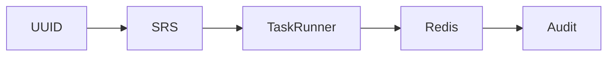
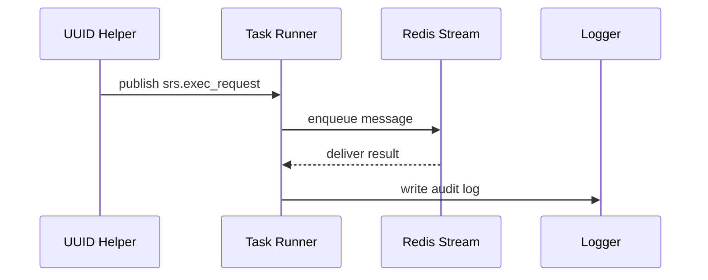

# 🧠 Project Architecture Guide Template
**Project:** [Name]  
**System Focus:** [UUID / SRS / Task Runner / etc.]  
**Author:** CortaLabs (Sanctum / UAP)  
**Version:** Draft v0.1  
**Last Updated:** [YYYY-MM-DD HH:MM UTC]

---

## 1. Overview
Provide a clear high-level description of the system or upgrade being implemented.  
Define its purpose, scope, and expected outcomes.  
Include a paragraph summarizing how this project fits into the larger Sanctum or UAP architecture.

---

## 2. Goals & Non-Goals

| Goals | Non-Goals |
|-------|-----------|
| Example: Integrate SRS codes with UUID fingerprints | Example: Add governance or Archon systems |

---

## 3. Component Map
Use Mermaid or ASCII diagrams to describe relationships between subsystems.

---

## 4. Integration Points

List how this system connects to existing services (Redis, Postgres, Config Engine, Task Runner, etc.).

| Integration | File Path | Description |
|-------------|-----------|-------------|
| Redis Streams | core/services/redis | Handles message-bus logic |
| Config Engine | /config_engine | Central configuration loader |

---

## 5. Schema Overview

Detail the database tables involved (e.g., sanctum_srs_codes, sanctum_srs_exec_log). Show CREATE TABLE snippets and key field purposes.

---

## 6. Message Flow (Redis Streams)

Explain the lifecycle of each event stream:

- `srs.exec_request`
- `srs.exec_result`
- `audit.events`
- `rcap.fetch`

Include a sequence diagram:

---

## 7. RCAP Design

Describe the recovery capsule structure, encryption, and inline/external storage logic. Include JSON examples.

---

## 8. Phase-by-Phase Implementation Plan

Summarize each phase and cross-link to PHASE_PLAN.md.

---

## 9. Testing & Verification

Outline the acceptance tests for this architecture (unit, integration, and regression).

---

## 10. Long-Term Roadmap

Describe how this system will evolve post-deployment.

---

## 11. Revision Log

| Date | Change | Author | Confidence |
|------|--------|--------|------------|
| [YYYY-MM-DD] | Initial draft | Codex | 0.95 |

