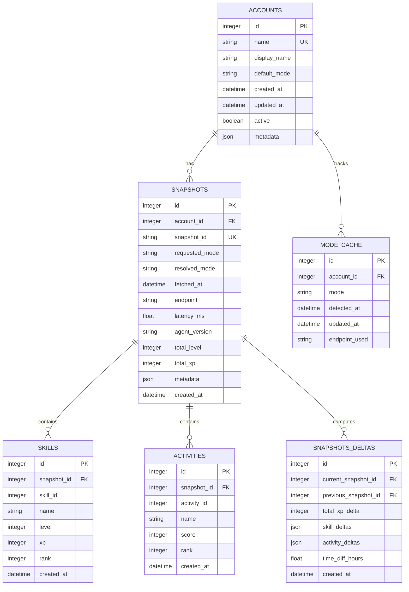

# Database Schema Design - OSRS Prometheus Analytics

## 🎯 Design Principles

### Primary Goals
- **Efficient Queries**: Optimized for time-series analytics and trend analysis
- **Scalability**: Handle millions of snapshots across thousands of accounts
- **Data Integrity**: Maintains consistency with JSON backup system
- **Flexibility**: Extensible for future features and custom metrics
- **Performance**: Sub-100ms response for common analytics queries

### Design Decisions
- **SQLite First**: Easy installation, single-file database
- **Normalized Structure**: Efficient storage and fast queries
- **Time-Series Optimization**: Indexed by timestamps for trend analysis
- **JSON Compatibility**: Easy migration from existing JSON files
- **Future-Proof**: Ready for PostgreSQL upgrade in SaaS version

## 🗄️ Schema Overview



## 📋 Detailed Table Definitions

### 1. ACCOUNTS
```sql
CREATE TABLE accounts (
    id INTEGER PRIMARY KEY AUTOINCREMENT,
    name TEXT UNIQUE NOT NULL,
    display_name TEXT,
    default_mode TEXT DEFAULT 'main',
    created_at TIMESTAMP DEFAULT CURRENT_TIMESTAMP,
    updated_at TIMESTAMP DEFAULT CURRENT_TIMESTAMP,
    active BOOLEAN DEFAULT TRUE,
    metadata JSON DEFAULT '{}'
);

-- Indexes for performance
CREATE INDEX idx_accounts_name ON accounts(name);
CREATE INDEX idx_accounts_active ON accounts(active);
CREATE INDEX idx_accounts_created_at ON accounts(created_at);
```

### 2. SNAPSHOTS
```sql
CREATE TABLE snapshots (
    id INTEGER PRIMARY KEY AUTOINCREMENT,
    account_id INTEGER NOT NULL,
    snapshot_id TEXT UNIQUE NOT NULL,
    requested_mode TEXT NOT NULL,
    resolved_mode TEXT NOT NULL,
    fetched_at TIMESTAMP NOT NULL,
    endpoint TEXT,
    latency_ms REAL,
    agent_version TEXT,
    total_level INTEGER,
    total_xp INTEGER,
    metadata JSON DEFAULT '{}',
    created_at TIMESTAMP DEFAULT CURRENT_TIMESTAMP,
    FOREIGN KEY (account_id) REFERENCES accounts(id) ON DELETE CASCADE
);

-- Critical indexes for analytics
CREATE INDEX idx_snapshots_account_id ON snapshots(account_id);
CREATE INDEX idx_snapshots_fetched_at ON snapshots(fetched_at);
CREATE INDEX idx_snapshots_account_fetched ON snapshots(account_id, fetched_at);
CREATE INDEX idx_snapshots_resolved_mode ON snapshots(resolved_mode);
CREATE INDEX idx_snapshots_total_xp ON snapshots(total_xp);
CREATE INDEX idx_snapshots_total_level ON snapshots(total_level);
```

### 3. SKILLS
```sql
CREATE TABLE skills (
    id INTEGER PRIMARY KEY AUTOINCREMENT,
    snapshot_id INTEGER NOT NULL,
    skill_id INTEGER NOT NULL,
    name TEXT NOT NULL,
    level INTEGER,
    xp INTEGER,
    rank INTEGER,
    created_at TIMESTAMP DEFAULT CURRENT_TIMESTAMP,
    FOREIGN KEY (snapshot_id) REFERENCES snapshots(id) ON DELETE CASCADE
);

-- Indexes for skill analytics
CREATE INDEX idx_skills_snapshot_id ON skills(snapshot_id);
CREATE INDEX idx_skills_skill_id ON skills(skill_id);
CREATE INDEX idx_skills_name ON skills(name);
CREATE INDEX idx_skills_level ON skills(level);
CREATE INDEX idx_skills_xp ON skills(xp);
CREATE INDEX idx_skills_snapshot_skill ON skills(snapshot_id, skill_id);
```

### 4. ACTIVITIES
```sql
CREATE TABLE activities (
    id INTEGER PRIMARY KEY AUTOINCREMENT,
    snapshot_id INTEGER NOT NULL,
    activity_id INTEGER NOT NULL,
    name TEXT NOT NULL,
    score INTEGER,
    rank INTEGER,
    created_at TIMESTAMP DEFAULT CURRENT_TIMESTAMP,
    FOREIGN KEY (snapshot_id) REFERENCES snapshots(id) ON DELETE CASCADE
);

-- Indexes for activity analytics
CREATE INDEX idx_activities_snapshot_id ON activities(snapshot_id);
CREATE INDEX idx_activities_activity_id ON activities(activity_id);
CREATE INDEX idx_activities_name ON activities(name);
CREATE INDEX idx_activities_score ON activities(score);
CREATE INDEX idx_activities_snapshot_activity ON activities(snapshot_id, activity_id);
```

### 5. SNAPSHOTS_DELTAS
```sql
CREATE TABLE snapshots_deltas (
    id INTEGER PRIMARY KEY AUTOINCREMENT,
    current_snapshot_id INTEGER NOT NULL,
    previous_snapshot_id INTEGER,
    total_xp_delta INTEGER DEFAULT 0,
    skill_deltas JSON DEFAULT '[]',
    activity_deltas JSON DEFAULT '[]',
    time_diff_hours REAL,
    created_at TIMESTAMP DEFAULT CURRENT_TIMESTAMP,
    FOREIGN KEY (current_snapshot_id) REFERENCES snapshots(id) ON DELETE CASCADE,
    FOREIGN KEY (previous_snapshot_id) REFERENCES snapshots(id) ON DELETE SET NULL
);

-- Indexes for delta analytics
CREATE INDEX idx_deltas_current_snapshot ON snapshots_deltas(current_snapshot_id);
CREATE INDEX idx_deltas_previous_snapshot ON snapshots_deltas(previous_snapshot_id);
CREATE INDEX idx_deltas_total_xp_delta ON snapshots_deltas(total_xp_delta);
CREATE INDEX idx_deltas_time_diff ON snapshots_deltas(time_diff_hours);
```

### 6. MODE_CACHE
```sql
CREATE TABLE mode_cache (
    id INTEGER PRIMARY KEY AUTOINCREMENT,
    account_id INTEGER NOT NULL,
    mode TEXT NOT NULL,
    detected_at TIMESTAMP NOT NULL,
    updated_at TIMESTAMP DEFAULT CURRENT_TIMESTAMP,
    endpoint_used TEXT,
    FOREIGN KEY (account_id) REFERENCES accounts(id) ON DELETE CASCADE
);

-- Indexes for mode lookup
CREATE INDEX idx_mode_cache_account_id ON mode_cache(account_id);
CREATE INDEX idx_mode_cache_updated_at ON mode_cache(updated_at);
CREATE UNIQUE INDEX idx_mode_cache_account_unique ON mode_cache(account_id);
```

## 🔄 Migration Strategy

### Phase 1: Initial Migration
1. **Create database structure** with above schema
2. **Import existing JSON snapshots** into database
3. **Maintain JSON backups** as primary storage initially
4. **Verify data integrity** between JSON and database
5. **Gradually transition** to database-first operations

### Phase 2: Dual Storage
1. **Continue JSON backups** for compatibility
2. **Database becomes primary** for queries and analytics
3. **Background sync** ensures consistency
4. **Performance testing** and optimization

### Phase 3: Database-First
1. **JSON becomes backup format only**
2. **All operations use database**
3. **Periodic JSON exports** for portability
4. **Ready for PostgreSQL upgrade** when needed

## 📊 Query Optimization

### Common Analytics Queries

#### 1. Player Progress Over Time
```sql
-- XP progression for a specific skill
SELECT
    s.fetched_at,
    sk.level,
    sk.xp,
    (sk.xp - LAG(sk.xp) OVER (ORDER BY s.fetched_at)) as xp_gain
FROM snapshots s
JOIN skills sk ON s.id = sk.snapshot_id
WHERE s.account_id = ? AND sk.name = ?
ORDER BY s.fetched_at;
```

#### 2. XP Rate Calculations
```sql
-- Hourly XP rate for recent activity
WITH time_gaps AS (
    SELECT
        s1.fetched_at as current_time,
        s2.fetched_at as previous_time,
        sk.xp - COALESCE(prev_sk.xp, 0) as xp_gain,
        (julianday(s1.fetched_at) - julianday(s2.fetched_at)) * 24 as hours_diff
    FROM snapshots s1
    JOIN skills sk ON s1.id = sk.snapshot_id
    LEFT JOIN snapshots s2 ON s2.account_id = s1.account_id
        AND s2.fetched_at = (
            SELECT MAX(fetched_at)
            FROM snapshots
            WHERE account_id = s1.account_id AND fetched_at < s1.fetched_at
        )
    LEFT JOIN skills prev_sk ON s2.id = prev_sk.snapshot_id AND prev_sk.name = sk.name
    WHERE s1.account_id = ? AND sk.name = ?
)
SELECT
    current_time,
    xp_gain,
    hours_diff,
    CASE WHEN hours_diff > 0 THEN xp_gain / hours_diff ELSE 0 END as xp_per_hour
FROM time_gaps
WHERE xp_gain > 0
ORDER BY current_time DESC
LIMIT 100;
```

#### 3. Skill Milestones
```sql
-- Track level achievements
SELECT
    s.fetched_at,
    sk.name,
    sk.level,
    LAG(sk.level) OVER (PARTITION BY sk.name ORDER BY s.fetched_at) as previous_level
FROM snapshots s
JOIN skills sk ON s.id = sk.snapshot_id
WHERE s.account_id = ? AND sk.level > 1
    AND LAG(sk.level) OVER (PARTITION BY sk.name ORDER BY s.fetched_at) != sk.level
ORDER BY s.fetched_at DESC;
```

## 🚀 Performance Considerations

### Index Strategy
- **Composite indexes** for common query patterns
- **Time-based indexes** for trend analysis
- **Foreign key indexes** for join performance
- **Partial indexes** for frequently accessed subsets

### Query Optimization
- **Prepared statements** for repeated queries
- **Query result caching** for expensive analytics
- **Batch operations** for data imports
- **Connection pooling** for concurrent access

### Storage Optimization
- **JSON compression** for metadata storage
- **Efficient data types** (INTEGER vs BIGINT decisions)
- **Table partitioning** (for future PostgreSQL upgrade)
- **Vacuum and analyze** schedules for maintenance

## 🔮 Future Extensibility

### Planned Enhancements
1. **Custom Metrics Table**: User-defined calculations and alerts
2. **Event Log Table**: Track significant achievements and milestones
3. **Analytics Cache**: Pre-computed complex calculations
4. **User Sessions**: Track GUI usage and preferences
5. **API Keys**: For future SaaS multi-tenant support

### Upgrade Path to PostgreSQL
- **Schema compatibility** designed for easy migration
- **Data types** chosen for PostgreSQL compatibility
- **Query syntax** using standard SQL features
- **Index strategy** transferable to PostgreSQL

---

**Schema Version**: 1.0
**Last Updated**: 2025-10-29
**Next Review**: After Phase 2 implementation