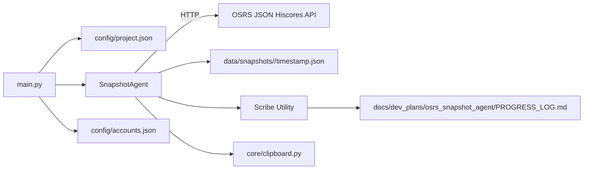
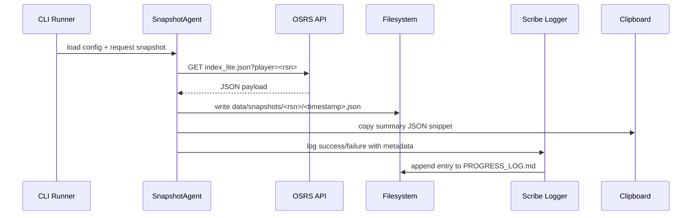

# 🧠 Project Architecture Guide
**Project:** codex-osrs-snapshot  
**System Focus:** Hiscore ingestion & snapshot storage  
**Author:** CortaLabs  
**Version:** Draft v0.1  
**Last Updated:** 2025-10-20 04:07 UTC

---

## 1. Overview
The OSRS Snapshot Agent fetches player statistics from the official Old School RuneScape JSON hiscores endpoints and persists timestamped snapshots for local analysis. The agent runs as a lightweight Python service driven by `main.py`, coordinating configuration loading, network calls, JSON normalization, and snapshot persistence. A shared Scribe utility records development and runtime milestones to a project progress log, ensuring traceability during iterative work. Future iterations will connect these snapshots to downstream analytics but the initial architecture emphasises a reliable single-account fetcher and reusable tooling within the repository.

---

## 2. Goals & Non-Goals

| Goals | Non-Goals |
|-------|-----------|
| Provide a configurable agent to fetch OSRS hiscore JSON for a given player | Build live RuneLite integrations or in-game event listeners |
| Persist snapshots to deterministic paths under `data/snapshots/<player>/` | Implement multi-region storage, compression, or encryption on day one |
| Maintain development audit trails via Scribe logging | Integrate with Sanctum Memory / Grail services during this phase |

---

## 3. Component Map



---

### 3.1 Directory Layout

```
agents/
├── __init__.py
└── osrs_snapshot_agent.py
core/
├── __init__.py
├── clipboard.py
├── constants.py
└── hiscore_client.py
config/
├── accounts.json
├── project.json
└── (env files)
data/
└── snapshots/ (player folders with timestamped JSON)
reports/
└── .gitkeep
scripts/
├── scribe.py
└── (future automation)
tests/
├── __init__.py
└── (unit/integration tests)
main.py
requirements.txt
```

---

## 4. Integration Points

| Integration | File Path | Description |
|-------------|-----------|-------------|
| Project Metadata | `config/project.json`, `.env` | Supplies project metadata, usernames, interval hints, and output directories. |
| Account List | `config/accounts.json` | Defines tracked accounts and preferred gamemodes. |
| HTTP Client | `core/hiscore_client.py` | Performs GET requests to OSRS hiscore JSON endpoints documented in `docs/api_guide.md`. |
| Constants Registry | `core/constants.py` | Houses gamemodes, activity enumerations, and formatted name helpers. |
| Storage | `data/snapshots/<player>/` | Local filesystem directory for timestamped JSON payloads. |
| Logging | `scripts/scribe.py` | Appends formatted progress entries to the project log for development visibility. |
| Clipboard export | `core/clipboard.py` | Copies summary snippets for quick sharing when supported. |

---

## 5. Core Functional Requirements

### 5.1 Player Snapshot APIs
- `get_stats(player: str, include_modes: bool = True) -> Player`: Returns a full player object with detected game mode, status flags (`dead`, `deulted`, `deironed`), and nested stats keyed by mode (mirroring `getStats`).
- `get_stats_by_gamemode(player: str, gamemode: str) -> Stats`: Fetches a single-mode stats object. Supported gamemodes follow OSRS nomenclature:

| Game mode        | Param        |
| ---------------- | ------------ |
| Regular          | `main`       |
| Ironman          | `ironman`    |
| Hardcore Ironman | `hardcore`   |
| Ultimate Ironman | `ultimate`   |
| Deadman Mode     | `deadman`    |
| Tournament       | `tournament` |
| Leagues          | `seasonal`   |

Implementation must gracefully surface 404/not-found cases and expose HTTP metadata for retry logic.

### 5.2 Leaderboard Endpoints
- `get_skill_page(skill: str, gamemode: str = "main", page: int = 1) -> list[LeaderboardEntry]`: Returns an array of 25 players representing a hiscore page (rank, name, level, xp, dead flag). Matches JS library `getSkillPage`.
- `get_activity_page(activity: str, gamemode: str = "main", page: int = 1) -> list[LeaderboardEntry]`: Supports clues, minigames, bosses, and points categories as enumerated below.

Both functions should accept lowercase identifiers and normalise aliases (e.g., underscores vs camelCase). Pagination is 1-indexed and should default to page 1.

### 5.3 Activity Enumerations
Activities include all clue tiers, minigames, point trackers, and bosses supported by the OSRS JSON hiscores API. Enumerations must be centralised so validation and formatted name helpers remain consistent.

**Clue Scrolls**

| Type     | Param            |
| -------- | ---------------- |
| All      | `allClues`       |
| Beginner | `beginnerClues`  |
| Easy     | `easyClues`      |
| Medium   | `mediumClues`    |
| Hard     | `hardClues`      |
| Elite    | `eliteClues`     |
| Master   | `masterClues`    |

**Minigames & Activities**

| Minigame                        | Param                |
| ------------------------------- | -------------------- |
| Bounty Hunter (Legacy - Rogue)  | `rogueBH`            |
| Bounty Hunter (Legacy - Hunter) | `hunterBH`           |
| Bounty Hunter (Rogue)           | `rogueBHV2`          |
| Bounty Hunter (Hunter)          | `hunterBHV2`         |
| LMS - Rank                      | `lastManStanding`    |
| PvP Arena - Rank                | `pvpArena`           |
| Soul Wars Zeal                  | `soulWarsZeal`       |
| Rifts closed                    | `riftsClosed`        |
| Colosseum Glory                 | `colosseumGlory`     |
| Collections Logged              | `collectionsLogged`  |

**Points**

| Activity       | Param           |
| -------------- | --------------- |
| League Points  | `leaguePoints`  |
| Deadman Points | `deadmanPoints` |

**Bosses**

| Boss Name                         | Param                          |
| --------------------------------- | ------------------------------ |
| Abyssal Sire                      | `abyssalSire`                  |
| Alchemical Hydra                  | `alchemicalHydra`              |
| Amoxliatl                         | `amoxliatl`                    |
| Araxxor                           | `araxxor`                      |
| Artio                             | `artio`                        |
| Barrows Chests                    | `barrows`                      |
| Bryophyta                         | `bryophyta`                    |
| Callisto                          | `callisto`                     |
| Calvar'ion                        | `calvarion`                    |
| Cerberus                          | `cerberus`                     |
| Chambers Of Xeric                 | `chambersOfXeric`              |
| Chambers Of Xeric: Challenge Mode | `chambersOfXericChallengeMode` |
| Chaos Elemental                   | `chaosElemental`               |
| Chaos Fanatic                     | `chaosFanatic`                 |
| Commander Zilyana                 | `commanderZilyana`             |
| Corporeal Beast                   | `corporealBeast`               |
| Crazy Archaeologist               | `crazyArchaeologist`           |
| Dagannoth Prime                   | `dagannothPrime`               |
| Dagannoth Rex                     | `dagannothRex`                 |
| Dagannoth Supreme                 | `dagannothSupreme`             |
| Deranged Archaeologist            | `derangedArchaeologist`        |
| Doom of Mokhaiotl                 | `doomOfMokhaiotl`              |
| Duke Sucellus                     | `dukeSucellus`                 |
| General Graardor                  | `generalGraardor`              |
| Giant Mole                        | `giantMole`                    |
| Grotesque Guardians               | `grotesqueGuardians`           |
| Hespori                           | `hespori`                      |
| Kalphite Queen                    | `kalphiteQueen`                |
| King Black Dragon                 | `kingBlackDragon`              |
| Kraken                            | `kraken`                       |
| Kree'arra                         | `kreeArra`                     |
| K'ril Tsutsaroth                  | `krilTsutsaroth`               |
| Lunar Chests                      | `lunarChests`                  |
| Mimic                             | `mimic`                        |
| Nex                               | `nex`                          |
| Nightmare                         | `nightmare`                    |
| Phosani's Nightmare               | `phosanisNightmare`            |
| Obor                              | `obor`                         |
| Phantom Muspah                    | `phantomMuspah`                |
| Sarachnis                         | `sarachnis`                    |
| Scorpia                           | `scorpia`                      |
| Scurrius                          | `scurrius`                     |
| Skotizo                           | `skotizo`                      |
| Sol Heredit                       | `solHeredit`                   |
| Spindel                           | `spindel`                      |
| Tempoross                         | `tempoross`                    |
| The Gauntlet                      | `gauntlet`                     |
| The Corrupted Gauntlet            | `corruptedGauntlet`            |
| The Hueycoatl                     | `hueycoatl`                    |
| The Leviathan                     | `leviathan`                    |
| The Royal Titans                  | `royalTitans`                  |
| The Whisperer                     | `whisperer`                    |
| Theatre Of Blood                  | `theatreOfBlood`               |
| Theatre Of Blood: Hard Mode       | `theatreOfBloodHardMode`       |
| Thermonuclear Smoke Devil         | `thermonuclearSmokeDevil`      |
| Tombs of Amascut                  | `tombsOfAmascut`               |
| Tombs of Amascut: Expert Mode     | `tombsOfAmascutExpertMode`     |
| TzKal-Zuk                         | `tzKalZuk`                     |
| TzTok-Jad                         | `tzTokJad`                     |
| Vardorvis                         | `vardorvis`                    |
| Venenatis                         | `venenatis`                    |
| Vet'ion                           | `vetion`                       |
| Vorkath                           | `vorkath`                      |
| Wintertodt                        | `wintertodt`                   |
| Yama                              | `yama`                         |
| Zalcano                           | `zalcano`                      |
| Zulrah                            | `zulrah`                       |

### 5.4 Helper Metadata
- Provide formatted-name maps (e.g., `FORMATTED_BOSS_NAMES['krilTsutsaroth'] -> "K'ril Tsutsaroth"`).
- Centralise constants for skills, activities, and bosses to maintain parity with the reference implementation.

---

## 6. Snapshot Schema

### Snapshot JSON
- Raw payload mirrors the structure returned by the OSRS JSON hiscores API, including skills, activities, clues, and bosses.
- Each persisted file should include:
  - `metadata`: player name, fetch timestamp (UTC), source URL, and any agent version string.
  - `data`: original JSON stats object as provided by the API.
- Optional normalization can map ranks, levels, and XP values into typed dictionaries for downstream analytics.

### Configuration Keys
- `project_name`: shared identifier for logs and tooling.
- `progress_log`: relative path to the progress ledger file.
- `default_emoji`, `default_agent`: defaults consumed by Scribe.
- Future keys may include retry limits, snapshot cadence, and target usernames (mirroring `.env` overrides).

---

## 7. Message Flow



---

## 8. Snapshot Payload Design

```json
{
  "metadata": {
    "player": "Austin_HCIM",
    "fetched_at": "2025-10-20T04:05:00Z",
    "endpoint": "https://secure.runescape.com/m=hiscore_oldschool/index_lite.json?player=Austin_HCIM",
    "agent_version": "0.1.0"
  },
  "data": {
    "skills": {
      "overall": {"rank": 12345, "level": 2277, "xp": 460000000},
      "attack": {"rank": 23456, "level": 99, "xp": 13034431}
    },
    "clues": {
      "all": {"rank": 34567, "score": 251}
    },
    "bosses": {
      "zulrah": {"rank": 45678, "score": 150}
    }
  }
}
```

- The metadata wrapper is optional in the raw API response and will be added by the agent prior to persistence.
- Downstream services should treat missing keys as zero or `None` to accommodate players who have not participated in certain activities.

---

## 9. Phase-by-Phase Implementation Plan

Implementation milestones are detailed in `docs/dev_plans/osrs_snapshot_agent/PHASE_PLAN.md`. Highlights:
- Phase 0: Repository scaffolding, dependency validation, baseline documentation.
- Phase 1: Implement SnapshotAgent, integrate Scribe logging, ensure snapshot persistence.
- Phase 2: Add configuration features, batching safeguards, and testing coverage.

---

## 10. Testing & Verification

- **Unit Tests:** Validate snapshot filename generation, metadata enrichment, and Scribe integration (dry-run mode).
- **Integration Tests:** Execute live fetch against the OSRS API in a controlled environment, verifying HTTP error handling (404, rate limits).
- **Regression Checks:** Ensure repeated snapshots for the same user create deterministic paths without overwriting previous files.
- **Manual QA:** Confirm progress log entries use the expected format and track key metadata such as duration or result status.

---

## 11. Long-Term Roadmap

- Introduce snapshot diffing and delta notifications.
- Support multiple player queues with concurrency controls respecting API limits.
- Optionally push snapshot summaries into analytical stores or vector databases.
- Encrypt or compress snapshots when storing long-term archives.
- Integrate with higher-level orchestration (cron, Airflow, or internal agents).

---

## 12. Revision Log

| Date | Change | Author | Confidence |
|------|--------|--------|------------|
| 2025-10-20 | Initial draft | Codex | 0.92 |
